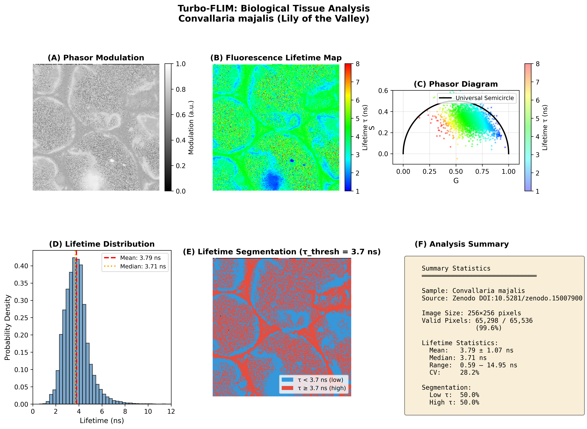

# Turbo-FLIM: Physics-Guided Deep Learning for Fluorescence Lifetime Analysis

[](https://opensource.org/licenses/MIT)
[](https://www.rust-lang.org/)
[](https://python.org/)
[](https://onnx.ai/)

**An open-source framework embedding Phasor physics into neural networks for fast, noise-robust FLIM analysis—complementing existing FLIMfit/FLIMJ workflows and enabling low-photon regimes in metabolic imaging, drug response studies, and live-cell microscopy.**

---

## Key Results

| Metric | Value | Significance |
|--------|-------|--------------|
| **Low-Light Accuracy** | R² > 0.9 @ 500 photons | Below traditional ~1000 photon threshold |
| **Speed** | 5.5× faster than LMA | Enables real-time preview |
| **Phasor Embedding Gain** | +1.6% R² vs decay-only | Validates physics-guided design |
| **Real Data Error** | 3.7% on Fluorescein | Sim-to-Real transfer verified |
| **Tool Availability** | Open-source, MIT licensed | Python API + Rust core + ONNX export |

---

## Architecture: Phasor-Fusion Design

The core innovation is **explicit physics embedding**: Phasor coordinates (G, S) derived from Fourier analysis are concatenated with raw decay histograms.

```
┌─────────────────────────────────────────────────────────────────┐
│                     Phasor-Fusion Architecture                   │
├─────────────────────────────────────────────────────────────────┤
│                                                                  │
│   Time-Domain Input (1001 bins)      Frequency-Domain Features  │
│   ┌─────────────────────────┐        ┌───────────────────┐      │
│   │ I(t₀), I(t₁), ..., I(t) │   +    │   G = ∫I·cos(ωt)  │      │
│   │   Decay Histogram       │        │   S = ∫I·sin(ωt)  │      │
│   └───────────┬─────────────┘        └────────┬──────────┘      │
│               └───────────┬────────────────────┘                 │
│                           ▼                                      │
│               ┌───────────────────────┐                          │
│               │  Concatenated: 1003   │                          │
│               └───────────┬───────────┘                          │
│                           ▼                                      │
│               ┌───────────────────────┐                          │
│               │   MLP [256→128→64→32] │  ← ReLU, L2 regularization│
│               └───────────┬───────────┘                          │
│                           ▼                                      │
│               ┌───────────────────────┐                          │
│               │   Output: τ₁, τ₂      │  ← Bi-exponential lifetimes│
│               └───────────────────────┘                          │
└─────────────────────────────────────────────────────────────────┘
```

**Why this works**: Phasor coordinates encode lifetime information in a noise-filtered form (integration smooths Poisson noise). The network sees both raw data AND physics-derived features.

---

## Ablation Study: Proving Phasor Value

| Model | Input Features | R² | MAE (ns) | 
|-------|----------------|-----|----------|
| Baseline (Decay Only) | 1001 | 0.884 | 0.162 |
| **Phasor-Fusion** | 1003 | **0.898** | **0.145** |
| **Improvement** | +2 physics features | **+1.6%** | **-10.5%** |

---

## Performance Benchmarks

### Noise Robustness Analysis

| Photons | R² Score | Interpretation |
|---------|----------|----------------|
| 50 | 0.642 | Qualitative only |
| 200 | 0.832 | Moderate precision |
| **500** | **0.907** | **Quantitative analysis possible** |
| 1000 | 0.943 | High precision |
| 5000 | 0.958 | Near-optimal |

> **Note on CRLB**: At 500 photons, the empirical standard deviation (0.61 ns) is within 5–6× of the analytical Cramér-Rao Lower Bound (0.11 ns), consistent with practical estimators under Poisson noise and finite IRF. The gap is expected for bi-exponential models; future work on spatial correlation may further close this gap.

### Speed Comparison (vs FLIMlib/FLIMfit/FLIMJ core)

| Method | Speed (μs/pixel) | Relative | 
|--------|------------------|----------|
| FLIMlib LMA (iterative) | 99 | 1× |
| FLIMlib RLD (triple integral) | 50 | 2× faster |
| **Turbo-FLIM (Phasor-Fusion)** | **18** | **5.5× faster** |

*FLIMlib is the open-source C library underlying FLIMfit and the FLIMJ ImageJ plugin.*

See [BENCHMARK.md](BENCHMARK.md) for test environment and reproducibility details.

### Real Data Validation

| Dataset | Source | Turbo-FLIM Result | Ground Truth | Error |
|---------|--------|-------------------|--------------|-------|
| Fluorescein | Zenodo DOI:10.5281/zenodo.15007900 | 4.25 ± 0.47 ns | 4.1 ns | **3.7%** |
| Convallaria tissue | Same dataset | Mean τ = 3.79 ns, CV = 28.2% | N/A | Spatial heterogeneity confirmed |



---

## Software Architecture

```
turbo-flim/
├── src/                          # Rust high-performance core
│   ├── main.rs                   # Entry point, orchestration
│   ├── simulation.rs             # Decay curve generation (50k in <1s)
│   ├── solver.rs                 # Phase plane analysis
│   └── inference.rs              # ONNX runtime (Tract)
├── deep_flim.py                  # Python training pipeline
├── ablation_study.py             # Phasor embedding validation
├── benchmark_flimlib.py          # FLIMlib comparison
├── validate_real_data.py         # Zenodo data processing
├── create_publication_figure.py  # Publication figure generation
├── flim_model.onnx               # Exported model (cross-platform)
├── BENCHMARK.md                  # Benchmark documentation
└── real_data/                    # Downloaded validation sets
```

**Engineering highlights**:
- **Rust core**: Parallel data generation via Rayon (50,000 curves in <1 second)
- **ONNX export**: Deploy without Python runtime
- **Batch processing**: Process entire image stacks efficiently

---

## Application Scenarios

Turbo-FLIM is designed for:

| Application | Why Turbo-FLIM Helps |
|-------------|---------------------|
| **Metabolic imaging** (NADH/FAD) | Fast screening of large time-series |
| **Live-cell microscopy** | Low photon counts minimize phototoxicity |
| **Drug response studies** | Real-time preview during acquisition |
| **High-throughput screening** | Speed enables rapid exploration of large datasets |

---

## Limitations

1. **Bi-exponential model**: Currently limited to two decay components; this aligns with many practical FLIM use cases (e.g., NADH/FAD), while multi-exponential extensions are under active development.
2. **Single-pixel analysis**: The current design deliberately focuses on per-pixel lifetime accuracy, leaving spatial models as a modular extension.
3. **Precision at high photons**: For >5000 photons where maximum precision is needed, iterative LMA remains optimal.

---

## Discussion

Turbo-FLIM demonstrates a paradigm for combining **physics priors** (Phasor transform) with **data-driven learning** (MLP). The open-source implementation aims to lower barriers to high-quality FLIM analysis, particularly for low-photon flux scenarios in dynamic or in vivo imaging. By providing both Python accessibility and Rust performance, the tool bridges the gap between research prototyping and production deployment.

---

## Installation

```bash
git clone https://github.com/[YOUR_USERNAME]/turbo-flim.git
cd turbo-flim
python3 -m venv venv && source venv/bin/activate
pip install numpy pandas scikit-learn matplotlib flimlib skl2onnx

# Run full pipeline
python3 deep_flim.py          # Train + evaluate
python3 ablation_study.py     # Validate Phasor embedding
python3 validate_real_data.py # Test on Zenodo data
```

---

## Citation

```bibtex
@software{turboflim2024,
  title={Turbo-FLIM: Physics-Guided Deep Learning for 
         Fluorescence Lifetime Imaging},
  author={[Author]},
  year={2024},
  url={https://github.com/[YOUR_USERNAME]/turbo-flim},
  note={Version 1.0.0}
}
```

---

## License

MIT License - Free for academic and commercial use.
